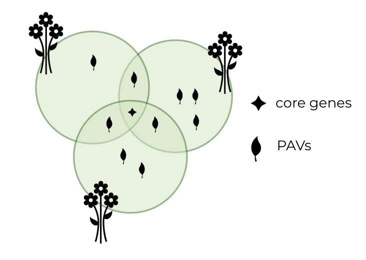
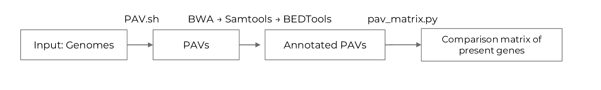
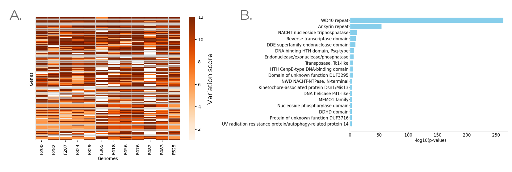

# 🌿🧬 Presence-absence variations in Fusarium oxysporum and Linum usitatissimum 🧬🌿

> **Arina Makeeva**  
> Research Project, Bioinformatics Institute
>
> 📬 aryamakeeva@gmail.com
> 
> 🧪 Supervisor: A. Samsonova, A.Kanapin, V.Stanin

---

## About this project

Plant genomes are dynamic landscapes shaped by genome duplications, gene loss, and the activity of mobile elements. These processes lead to structural variants, including **Presence/Absence Variations (PAVs)** — genomic regions present in some individuals but completely absent in others (Figure 1).



In this study, we investigate the role of PAVs in shaping:

- **Virulence** in the pathogenic fungus *Fusarium oxysporum* f. sp. lini.  
- **Resistance** in two flax (*Linum usitatissimum*)cultivars

*Keywords:* PAV, structural variation, Flax, Fusarium

---

## Datasets

- **12 genomes of *F. oxysporum*** ([PRJNA630722](https://www.ncbi.nlm.nih.gov/bioproject/?term=PRJNA630722), [PRJNA721899](https://www.ncbi.nlm.nih.gov/bioproject/?term=PRJNA721899)) ([Logachev et al., 2024](https://www.frontiersin.org/journals/plant-science/articles/10.3389/fpls.2024.1383914/full))
- **Two *Linum usitatissimum* cultivars** ([Rozhmina et al., 2024](https://link.springer.com/article/10.1134/S0006350924700076)):  
  - *AT* (resistant)  
  - *LM98* (susceptible) 

---

## PAV Analysis Pipeline 



The required software environment is defined in the `environment.yaml` file.

```bash
conda env create -f environment.yaml
conda activate PAV_analysis
```

### 1. Pairwise PAV Analysis with `scanPAV`

A custom script based on the [repository example](https://github.com/wtsi-hpag/scanPAV). 
Location: `./code/1_PAV.sh`

This script performs pairwise Presence/Absence Variation (PAV) analysis between multiple genome assemblies using the [`scanPAV`](https://github.com/baoxingsong/scanPAV) tool.

For each pair of genomes A vs B:
- Detects sequences present in A and absent in B (`pavs_present_in_A_vs_B`)
- Then sequences present in B and absent in A (`pavs_absent_in_A_vs_B`)
- Results are saved in separate folders for each comparison

The script creates a dedicated working directory for each run and logs all steps to `log.txt`.

**Mechanism:**
1. The "presence" assembly is split into 1000 bp chunks (after removing Ns)  
2. These chunks are aligned to the "absence" assembly using `bwa` (or other aligner)  
3. Consecutive unmapped chunks are merged into larger regions and reported as absence PAVs

**Limitation:**  
The output consists of sequence fragments (~1000 bp and longer), not annotated genes. As a result, genes may be partially recovered or missed entirely, depending on their position and length relative to the chunking and merging steps.

**Input:**  
- List of genome assemblies  
- Corresponding sample names

**Output:**  
- Pairwise PAV result directories

Example output structure:

```
scanpav_run_YYYYMMDD_HHMMSS/
├── sample1.fa -> /path/to/assembly1.fa
├── sample2.fa -> /path/to/assembly2.fa
├── pavs_present_in_sample1_vs_sample2/
├── pavs_absent_in_sample1_vs_sample2/
└── log.txt
```

---

### 2. Index the Reference Genome

```bash
bwa index reference.fasta
```

---

### 3. Align Genomes to Reference

```bash
bwa mem "$reference_genome" "$fasta_file" > "$output_dir/${base_name}.sam"
```

### 4. Convert SAM → Sorted BAM + Index

```bash
bam_file="./alignment_bam/$(basename "${sam_file%.sam}.bam")"
samtools view -Sb "$sam_file" > "$bam_file"

sorted_bam_file="./alignment_bam/$(basename "${sam_file%.sam}_sorted.bam")"
samtools sort -o "$sorted_bam_file" "$bam_file"

samtools index "$sorted_bam_file"
```
### 5. Annotate Genes

```bash
bedtools intersect -a "$reference_gff" -b "$bam_file" -wa -wb > "$output_dir/${base_name}_annotated_genes.txt"
```

### 6. Generate PAV Matrix

A binary matrix is created from gene lists to summarise gene presence in each pairwise comparison (`./code/2_pav_matrix.py`):

- `1` — gene is unique to genome A
- `0` - gene is shared between genomes A and B

The downstream analysis and data visualisation were performed using the following Python packages: `pandas`, `numpy`, `scipy.stats`, `seaborn`, `matplotlib`. Notebooks with follow analysis are in `./code` folder

Example of the output:

```bash
🧬 Matrix saved to gene_presence_matrix.tsv
🔢 Total genes: 2487 | Comparisons: 156
      COMP_1  COMP_2  COMP_3  ...
GeneA       1       0       1
GeneB       1       1       0
...
```
---

## Results

- Among 12 Fusarium genomes we identified 233 highly divergent genes (Figure 2.A), and examined domain differences (Figure 2.B);



*Figure 2. A - Heatmap of the most variable genes across the analysed Fusarium strains, based on presence/absence variation. B - GO enrichment analysis of protein domains associated with the top 5% of genes ranked by variation score. Bars represent significantly enriched functional categories; values indicate p-values calculated using the hypergeometric test*

- Compared the gene content between a susceptible and a resistant flax variety (Figure 3.A)and performed GO enrichment analysis. Genes specific to the susceptible variety are associated with processes related to cell degradation and viral activity, whereas genes unique to the resistant variety are enriched in cellular defence mechanisms, including mitochondrial regulation and calcium signalling (Figure 3.B).


*Figure 3. A - Venn diagram showing the number of unique and shared genes between the susceptible and resistant flax varieties. B - Gene Ontology (GO) enrichment analysis of variety-specific genes. Bars represent enriched biological processes; values indicate p-values calculated via hypergeometric test*

- Our findings suggest that PAVs contribute to differential pathogenicity in *F. oxysporum* f. sp. lini.and resistance in flax. Gene content analysis revealed that the susceptible flax cultivar is enriched in genes associated with cell degradation and viral-related processes, while the resistant cultivar shows an overrepresentation of genes linked to cellular defence, including mitochondrial regulation and calcium signalling. 

---

## Future plans

The integration of PAV detection with functional annotation opens new perspectives for exploring the evolutionary dynamics of resistance and pathogenicity-related genes in host–pathogen systems. In future work, we aim to investigate the genomic context surrounding the identified PAVs to better understand the mechanisms driving their emergence and maintenance. Check for updates ⭐️


